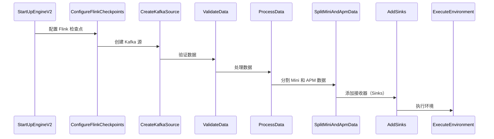

# Kafka-2-Flink-2-Doris

大数据实践,将 Kafka 中的数据读取到 Flink 中，处理完成之后写入到 Doris 中,下图为整个执行流程



> **Doris 介绍**
>
> Apache Doris 是一个基于 MPP 架构的高性能、实时的分析型数据库，
> 以极速易用的特点被人们所熟知，仅需亚秒级响应时间即可返回海量数据下的查询结果，不仅可以支持高并发的点查询场景，也能支持高吞吐的复杂分析场景。
> 基于此，Apache Doris 能够较好的满足报表分析、即席查询、统一数仓构建、数据湖联邦查询加速等使用场景。
>
{style="note"}

## 配置 Flink 检查点

```Java
        StreamExecutionEnvironment env = StreamExecutionEnvironment.getExecutionEnvironment();
        // 每隔2 000 ms进行启动一个检查点
        env.enableCheckpointing(25 * 1000);
        env.getCheckpointConfig().setCheckpointTimeout(60 * 1000);
        env.getCheckpointConfig().setMaxConcurrentCheckpoints(1);

        // 设置模式为exactly-once 默认(this is the default)
        // enableExternalizedCheckpoints用于开启checkpoints的外部持久化，但是在job失败的时候不会自动清理，需要自己手工清理state；
        // ExternalizedCheckpointCleanup用于指定当job canceled的时候externalized checkpoint该如何清理，
        // DELETE_ON_CANCELLATION的话，在job canceled的时候会自动删除externalized state，但是如果是FAILED的状态则会保留;
        // RETAIN_ON_CANCELLATION则在job canceled的时候会保留externalized checkpoint state
        env.getCheckpointConfig().setCheckpointingMode(CheckpointingMode.EXACTLY_ONCE);
        // 需要 Flink 版本高于 1.12
        env.getCheckpointConfig().setExternalizedCheckpointCleanup(CheckpointConfig.ExternalizedCheckpointCleanup.RETAIN_ON_CANCELLATION);
```
The following properties are required for building a KafkaSource:

* Kafka 需要提前启动 Bootstrap servers
* Topics / partitions to subscribe, see the following Topic-partition subscription for more details.
* Deserializer to parse Kafka messages, see the following Deserializer for more details.

## 创建 Kafka 数据源
Flink 1.12 版本之后提供了 Kafka 的连接器
```Java
    // Flink 1.12 版本之后提供了 KafkaSource
    // 只需要设置好 Kafka 的地址和 Topic 即可
    KafkaSource<String> source = KafkaSource.<String>builder()
                .setBootstrapServers(brokers)
                .setTopics(topic)
                .setGroupId(groupId)
                .setStartingOffsets(OffsetsInitializer.earliest())
                .setValueOnlyDeserializer(new SimpleStringSchema())
                .build();

        DataStreamSource<String> kafkaSource = env
                .fromSource(source, WatermarkStrategy.noWatermarks(), "Kafka Source"); 
```

## 验证数据
在我们的场景中，Kafka 保存的消息是 JSON 类型，当然也有可能不是 JSON 类型的错误数据
这里使用 Fastjson2 来做 JSON 类型的格式校验，校验不通过的数据，输出到 ERROR_LOG 流中做错误日志的处理
```Java
 @Override
    public void processElement(String value, Context ctx, Collector<String> out) {

        if (!JSON.isValid(value)
                || !value.contains(CommonFields._GAMEPLT_)
                || !value.contains(CommonFields._TYPE_)
                || !value.contains(CommonFields._TIME_)) {
            if (!value.isEmpty()) {
                //log.info("Transform value  {}", value);
                ctx.output(SplitUserAndEventAndErrorStream.ERROR_LOG_TAG, value);
            }
        } else {
            out.collect(value);
        }

    }
```

在 ERROR_LOG 流中，使用 Kotlin 写了一个静态函数来做错误数据的处理（单纯是想学习 Kotlin）

```Kotlin
fun convert(value: String): ErrorInfo {

    //println("Convert value: $value")
    val errorInfo = ErrorInfo()
    var err: JSONObject = JSONObject()
    val errorTips = mutableListOf<String>()

    val fieldsToCheck = mapOf(
        CommonFields._TIME_ to 255,
        CommonFields._GAMEPLT_ to 50,
        CommonFields._TYPE_ to 200,
        CommonFields._UTC_ to 255
    )

    if (!JSON.isValid(value )) {
        errorTips.add("err_msg 不是 JSON 类型数据")
    }else{
        err = JSONObject.parseObject(value)
        for ((field, maxLength) in fieldsToCheck) {
            if (!err.containsKey(field)) {
                errorTips.add("缺失 $field 字段")
            } else if (err.getString(field).length >= maxLength) {
                errorTips.add(" $field 字段长度大于 $maxLength ")
            }
        }
    }
    // 生成错误信息
    val ct = DateUtil.timeStamp2Date(System.currentTimeMillis(), "yyyy-MM-dd HH:mm:ss")

    with(errorInfo) {
        _time_ = err.getOrDefault(CommonFields._TIME_, "1970-01-01 00:00:00").toString()
        _gameplt_ = err.getOrDefault(CommonFields._GAMEPLT_, "none").toString()
        _type_ = err.getOrDefault(CommonFields._TYPE_, "none").toString()
        errorMsg = errorTips.toString()
        md5 = DigestUtils.md5Hex(value)
        errorMsg = value
        offset = err.getOrDefault(CommonFields.KUDU_KAFKA_OFFSET, "none").toString()
        flinkTime = ct
    }

    return errorInfo
}
```
字符串类型的数据在经过这个函数之后，会转换成 ErrorInfo 类型的数据，交给 Sink 去做数据持久化的处理


